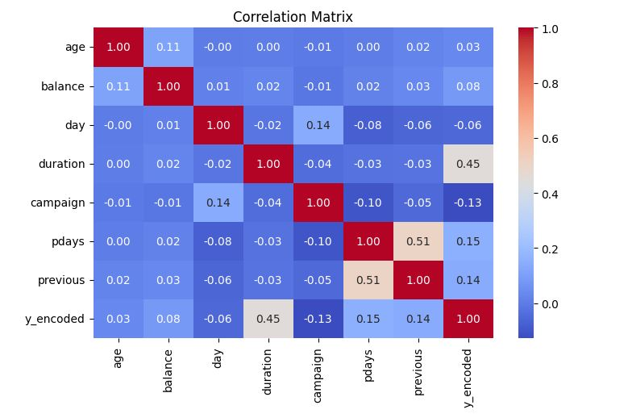
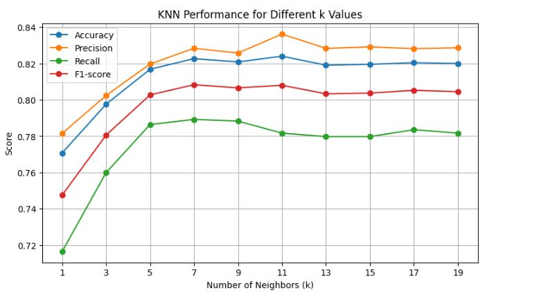
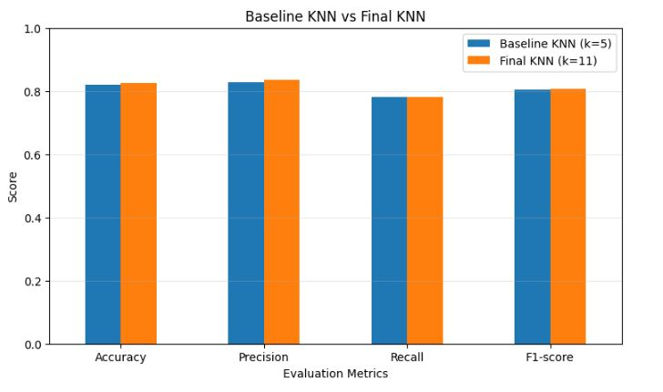

# 🏦 Bank Marketing Campaign Success Prediction

## 📌 Project Overview

This project develops a machine learning classification system to predict whether a customer will **subscribe to a bank term deposit** as a result of a marketing campaign.

The project follows a complete end-to-end machine learning workflow, starting from **business understanding and exploratory data analysis (EDA)** and progressing through data preprocessing, multiple classification algorithms, cross-validation, hyperparameter tuning, model comparison, and final model selection.

Rather than relying on a single algorithm, four different machine learning approaches were trained and evaluated:

* **K-Nearest Neighbors (KNN)**
* **Naive Bayes**
* **Decision Tree**
* **Support Vector Machine (SVM)**

After comparing their performance using classification metrics, **SVM was selected as the final model** because it provided the strongest overall performance among the tested models.

---

# 🎯 Business Problem

Banks conduct marketing campaigns to encourage customers to subscribe to financial products such as term deposits.

However, contacting every customer can result in:

* Unnecessary marketing costs
* Wasted employee time
* Low conversion rates
* Inefficient customer targeting

### Business Question

> **Can we predict whether a customer will subscribe to a term deposit based on their demographic, financial, and previous campaign information?**

A machine learning solution can help the bank identify customers who are more likely to respond positively to a marketing campaign and improve the efficiency of future campaigns.

---

# 📊 Dataset

Dataset Link : https://www.kaggle.com/datasets/janiobachmann/bank-marketing-dataset/data

The project uses the **Bank Marketing Dataset**, containing customer demographic, financial, and campaign-related information.

The target variable is:

```text
deposit
```

with two possible outcomes:

```text
yes → Customer subscribed
no  → Customer did not subscribe
```

### Main Feature Categories

The dataset contains information related to:

* Age
* Job
* Marital status
* Education
* Default status
* Account balance
* Housing loan
* Personal loan
* Contact type
* Contact day
* Contact month
* Call duration
* Number of campaign contacts
* Days since previous contact
* Number of previous contacts
* Previous campaign outcome

---

# 🔄 Machine Learning Workflow

```text
Business Understanding
        ↓
Data Understanding
        ↓
Data Cleaning
        ↓
Exploratory Data Analysis
        ↓
Business Insights
        ↓
Feature Engineering
        ↓
Train/Test Split
        ↓
Categorical Encoding
        ↓
Feature Scaling
        ↓
KNN Baseline
        ↓
Cross-Validation
        ↓
KNN Hyperparameter Tuning
        ↓
Naive Bayes
        ↓
Decision Tree
        ↓
SVM
        ↓
Model Comparison
        ↓
Final Model Selection
        ↓
Business Recommendations
```

---

# 🔎 1. Exploratory Data Analysis

EDA was performed before model training to understand the structure, distribution, relationships, and business patterns within the data.

The analysis included:

* Dataset structure
* Data types
* Missing values
* Duplicate records
* Unique values
* Target distribution
* Numerical feature distributions
* Categorical feature distributions
* Outlier analysis
* Correlation analysis

### Visualizations Used

* Histograms
* Boxplots
* Countplots
* Bar plots
* Scatter plots
* Correlation heatmap

---

# 📈 2. Numerical Feature Analysis

Histograms were used to understand the distributions of numerical variables.

This helped identify:

* Skewness
* Outliers
* Distribution patterns
* Potential preprocessing requirements

One important example was the `pdays` feature, which showed a highly skewed distribution.

---

# ⚠️ 3. Handling Sentinel Values

The `pdays` feature contains a special value representing customers who had **not previously been contacted**.

Instead of treating this value as an ordinary numerical measurement, its business meaning was considered.

A `never_contacted` feature was created to distinguish customers who had never previously been contacted from those who had.

This is an example of **feature engineering based on domain meaning**, rather than simply applying a statistical transformation.

---

# 📦 4. Outlier Analysis

Boxplots were used to identify potential outliers in numerical features.

However, extreme values were not automatically removed.

The reason is that an extreme value is not necessarily an error.

For example, a customer with an unusually high account balance may represent a genuine customer and could contain valuable predictive information.

Therefore, potential outliers were evaluated from both a statistical and business perspective.

---

# 📊 5. Categorical Feature Analysis

Categorical variables were analyzed using countplots and bar plots.

Examples included:

* Job
* Marital status
* Education
* Housing
* Loan
* Contact
* Month
* Previous campaign outcome

This analysis helped identify differences in customer behavior across different groups.

---

# 💡 6. Business Insights From EDA

EDA was not performed only for visualization. It was also used to answer meaningful business questions.

## 🏠 Housing Loan vs Deposit

Customers without a housing loan showed a higher subscription rate than customers with a housing loan.

Approximate rates observed:

| Housing Loan | Subscription Rate |
| ------------ | ----------------: |
| No           |              ~56% |
| Yes          |              ~38% |

### Insight

Customers without housing loans appeared more likely to subscribe to the term deposit.

This may indicate differences in disposable income or financial behavior.

---

## 💳 Personal Loan vs Deposit

Customers without a personal loan also showed a higher subscription rate.

Approximate rates observed:

| Personal Loan | Subscription Rate |
| ------------- | ----------------: |
| No            |              ~49% |
| Yes           |              ~32% |

### Insight

Customers without existing personal loans appeared more receptive to the term-deposit campaign.

These relationships could be investigated further when developing customer targeting strategies.

---

# 🔗 7. Correlation Analysis

A correlation heatmap was used to analyze relationships between numerical features.

The heatmap helped identify:

* Strong and weak relationships
* Potential multicollinearity
* Relationships between numerical variables

However, correlation was not used as the sole feature-selection technique because several machine learning algorithms can capture relationships that are not purely linear.



---

# 🧹 8. Data Preprocessing

Preprocessing was an important part of this project because the dataset contained both numerical and categorical variables.

The preprocessing pipeline included:

```text
Numerical Features
        ↓
Feature Scaling

Categorical Features
        ↓
One-Hot Encoding

        ↓

Combined Feature Matrix
        ↓
Machine Learning Models
```

---

## 🔤 Categorical Encoding

Categorical variables were converted into numerical representations using:

```python
OneHotEncoder(handle_unknown="ignore")
```

Using `handle_unknown="ignore"` prevents errors when an unseen category appears in the test data.

---

# ⚖️ 9. Feature Scaling

Feature scaling was particularly important because some of the selected algorithms rely on distances or feature magnitudes.

For example:

* KNN uses distance calculations.
* SVM can also be sensitive to feature scale.

Scaling ensures that features with larger numerical ranges do not disproportionately influence the model.

---

# 🤖 10. Model Development

Four classification algorithms were trained and evaluated.

### Models Used

```text
1. K-Nearest Neighbors
2. Naive Bayes
3. Decision Tree
4. Support Vector Machine
```

Each model provides a different approach to solving the classification problem.

---

# 📍 11. K-Nearest Neighbors

KNN was used as the first classification model.

KNN predicts a customer's class based on the classes of the nearest observations in feature space.

Conceptually:

```text
New Customer
      ↓
Calculate distances
      ↓
Find K nearest customers
      ↓
Majority voting
      ↓
Prediction
```

---

## KNN Baseline

The initial KNN model achieved approximately:

**Accuracy: 81.68%**

### Confusion Matrix

```text
[[992 183]
 [226 832]]
```

### Classification Report

| Class | Precision | Recall | F1-Score |
| ----- | --------: | -----: | -------: |
| 0     |      0.81 |   0.84 |     0.83 |
| 1     |      0.82 |   0.79 |     0.80 |

The model showed relatively balanced performance across both classes.


---

# 🔄 12. KNN Cross-Validation

After building the initial KNN model, cross-validation was performed to obtain a more reliable estimate of its performance.

Instead of evaluating the model on a single validation split, the training data was divided into multiple folds.

```text
Fold 1 → Validation
Fold 2 → Training
Fold 3 → Training
Fold 4 → Training
Fold 5 → Training

↓

Repeat until every fold has been used for validation
```



Cross-validation helped determine whether the model's performance was consistent across different subsets of the training data.

---

# 🎯 13. KNN Hyperparameter Tuning

The main KNN hyperparameter investigated was:

```text
K
```

Different values were tested, including values in the range:

```text
5 → 11
```

The goal was to find a K value that provided the best validation performance.

The best-performing configuration was approximately:

```text
K = 11
```



The improvement was relatively small, around **1–2%**.

### Key Learning

Hyperparameter tuning does not always produce a dramatic improvement.

In this case, changing K improved the model slightly, but the improvement was not large.

This demonstrated the importance of evaluating whether a tuning improvement is actually meaningful rather than assuming that more tuning always produces a better model.

---

# 🧠 14. Naive Bayes

After evaluating KNN, **Naive Bayes** was trained as another classification approach.

Naive Bayes is a probabilistic classifier based on Bayes' theorem.

It assumes that features contribute independently to the prediction given the target class.

Conceptually:

```text
Customer Features
       ↓
Calculate class probabilities
       ↓
Compare probabilities
       ↓
Predicted Class
```

Naive Bayes provided a useful comparison against the distance-based KNN model.

---

# 🌳 15. Decision Tree

A **Decision Tree Classifier** was then trained.

Decision Trees classify observations by creating a series of decision rules.

Conceptually:

```text
             Feature?
            /        \
          Yes         No
          /            \
     Feature?        Feature?
      /   \            /   \
    Yes   No         Yes   No
     ↓     ↓          ↓     ↓
   Class Class      Class Class
```

The model learns these decision rules from the training data.

### Why Decision Tree?

Decision Trees were useful to test because they:

* Handle numerical and categorical-derived features
* Can capture non-linear relationships
* Are relatively easy to interpret
* Do not rely on distance calculations

---

# 🧮 16. Support Vector Machine

Finally, a **Support Vector Machine (SVM)** classifier was trained.

SVM attempts to find a decision boundary that separates different classes while maximizing the margin between them.

Conceptually:

```text
Class 0     | Decision Boundary |     Class 1
  ● ● ● ●    |                   |    ○ ○ ○ ○
  ● ● ●      |                   |    ○ ○ ○
```

SVM was particularly suitable for experimentation in this project because the data had undergone feature encoding and scaling.

---

# 🏆 17. Model Comparison

After training all four models, their performance was compared using classification metrics.

The main metrics considered were:

* Accuracy
* Precision
* Recall
* F1-score
* Confusion Matrix

### Model Comparison

| Model             |   Accuracy | Precision (1) | Recall (1) |   F1 (1) |
| ----------------- | ---------: | ------------: | ---------: | -------: |
| **KNN**           |     82.00% |          0.83 |       0.78 |     0.80 |
| **Naive Bayes**   |     72.01% |          0.78 |       0.57 |     0.66 |
| **Decision Tree** |     78.77% |          0.78 |       0.77 |     0.77 |
| **SVM**           | **85.54%** |      **0.88** |   **0.82** | **0.85** |


---

# 🥇 18. Final Model Selection — SVM

After comparing the four algorithms, **SVM was selected as the final model** because it provided the strongest overall performance among the tested approaches.

The selection was based on the combined evaluation of:

* Accuracy
* Precision
* Recall
* F1-score
* Overall classification performance

The goal was not simply to select the model with the highest accuracy.

Instead, the model was evaluated more comprehensively to ensure that its performance was strong across the classification metrics.

---

# 📊 Why SVM Was Preferred

The model comparison demonstrated an important machine learning principle:

> **The best model is not necessarily the first model you train.**

Different algorithms make different assumptions and learn patterns differently.

In this project:

```text
KNN
 ↓
Cross-Validation
 ↓
Hyperparameter Tuning
 ↓
Naive Bayes
 ↓
Decision Tree
 ↓
SVM
 ↓
Model Comparison
 ↓
SVM Selected
```

This systematic comparison provided a stronger basis for selecting the final model.

---


# 💼 19. Business Interpretation

The final model can potentially help a bank move from:

```text
Mass Marketing
      ↓
Contact Everyone
```

toward:

```text
Predict Customer Response
      ↓
Rank Customers
      ↓
Prioritize High-Potential Customers
      ↓
Targeted Marketing
      ↓
Better Campaign Efficiency
```

This could help the bank:

* Reduce unnecessary calls
* Prioritize high-potential customers
* Improve campaign efficiency
* Reduce marketing costs
* Increase potential conversion rates

---

# 🚀 20. Future Improvements

Although the project achieved promising results, several improvements could be explored.

### Model Improvements

* Further SVM hyperparameter tuning
* Kernel comparison
* GridSearchCV / RandomizedSearchCV
* Random Forest
* Gradient Boosting
* XGBoost

### Feature Engineering

* Customer segmentation
* More meaningful treatment of `pdays`
* Interaction features
* Campaign-frequency features
* Customer financial behavior features

### Evaluation

* ROC-AUC
* Precision-Recall AUC
* Cross-validation for all models
* Threshold optimization
* Cost-sensitive evaluation

### Deployment

The final model could eventually be deployed using:

* FastAPI
* Flask
* Streamlit

to create a customer prediction application.

---

# 🛠️ 21. Technologies Used

### Programming

* Python

### Data Analysis

* Pandas
* NumPy

### Visualization

* Matplotlib
* Seaborn

### Machine Learning

* Scikit-learn

### Development Environment

* Jupyter Notebook

### Algorithms

* K-Nearest Neighbors
* Naive Bayes
* Decision Tree
* Support Vector Machine

---

# 📁 22. Project Structure

```text
bank-marketing-prediction/
│
├── data/
│   └── bank_marketing.csv
│
├── notebooks/
│   └── bank_marketing_prediction.ipynb
│
├── images/
│   ├── Countplot.png
│   ├── barplot.png
│   ├── correlation_heatmap.png
│   ├── confusion_matrix.png
│   └── model_comparison.png
│
├── README.md
├── requirements.txt
└── .gitignore
```

---

# 🎓 23. Key Takeaways

This project provided practical experience with the complete machine learning workflow:

### Data Understanding

Understanding the dataset before modeling.

### EDA

Using visualizations to discover patterns and answer business questions.

### Feature Engineering

Creating meaningful variables such as `never_contacted`.

### Preprocessing

Using encoding and scaling appropriately.

### Model Development

Training multiple classification algorithms rather than relying on one model.

### Cross-Validation

Using cross-validation to obtain more reliable model estimates.

### Hyperparameter Tuning

Testing different K values for KNN and evaluating whether the improvement was meaningful.

### Model Comparison

Comparing KNN, Naive Bayes, Decision Tree, and SVM using multiple evaluation metrics.

### Model Selection

Selecting **SVM** as the final model based on its overall performance.

---

# 🏁 Conclusion

This project demonstrates an end-to-end approach to solving a real-world **bank marketing classification problem**.

The project began with exploratory data analysis to understand customer behavior and identify meaningful business patterns. After cleaning and preprocessing the data, KNN was initially developed and evaluated.

KNN was then improved through **cross-validation and hyperparameter tuning**, with K=11 providing a modest performance improvement.

To determine whether another algorithm could perform better, the project was expanded to include **Naive Bayes, Decision Tree, and Support Vector Machine**.

After comparing the models using multiple classification metrics, **SVM was selected as the final model** because it demonstrated the strongest overall performance.

The most important lesson from this project was that building a good machine learning solution is not simply about training a model. It involves:

> **Understanding the business problem → exploring the data → preprocessing correctly → testing multiple algorithms → validating models → comparing performance → and selecting the model that best solves the business problem.**

---

## 👨‍💻 Author

**Muhammad Waqas**

BS Computer Science | Data Science & Machine Learning

---

⭐ **If you found this project useful, feel free to explore the notebook and experiment with different algorithms, preprocessing techniques, and hyperparameters.**
